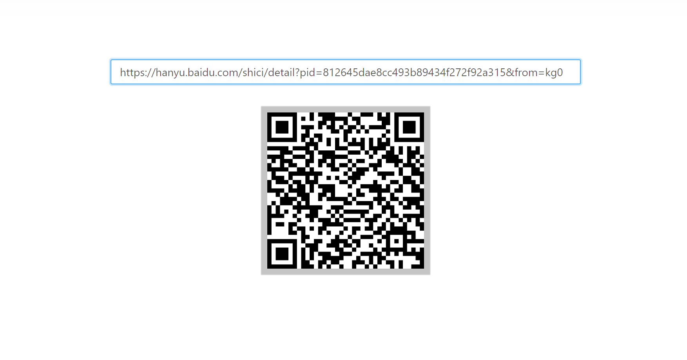

此项目主要用于提升技术和工作体验

# 提升工作体验

将繁琐的事情可视化、工程化,默认会在当前电脑 ipv4 地址打开

它们属于离线应用,数据借助[sf-inner-service](https://github.com/xiaodun/sf-inner-service)存储在磁盘上而不是浏览器里,自然能做到纯浏览器实现不了的事。

这些功能更适合前端程序员,所以有以下特点

- 如果直接改变数据更简单则不会去做界面

- 如非逻辑漏洞影响使用,不会考虑太多边界情况、不同行为习惯等,已常见的操作场景为准

- 不会有太多的表单验证,除非能引起逻辑错误,不会有太多操作提醒,类似删除问一下是不是要删除这种。

- 只适合一人部署一套

## 全局功能

生成当前页面的二维码,方便手机访问

## 记事本

在工作当中一些内容是需要整理的,文档链接、账号密码等。

此工具可以满足相对短暂的记录需要,如果想要长期存储可考虑在线文档。

[使用手册](./manual/0记事本/记事本.md)

## 项目管理

- 管理前端项目的启动、多环境联调,sf-mock 可视化操作 [使用文档](./manual/1项目管理/0.项目列表.md)

- swagge2.0 接口文档,简化 UI,扩展功能(生成枚举代码；复制数据结构；批量生成 ajax 代码、mock 文件等) [使用文档](./manual/1项目管理/1.Swagger.md)

- 超越封装极限,低代码平台实践，记录你日常开发中的操作，如新建一个模块，一个页面、一个组件等 [使用文档](./manual/1项目管理/3.代码片段.md)

## 迭代开发

- 记录迭代中涉及的信息，蓝湖文档、项目分支、系统账号[使用文档](./manual/2迭代开发/0.信息录入.md)

- 可以批量添加项目,支持创建分支、合并代码、从主分支拉取等[使用文档](./manual/2迭代开发/1.迭代发版.md)

## 文件管理

方便手机和电脑之间的信息传输,提供了上传、下载、删除功能

## 活动领取

有时候按部就班的做事情难免枯燥,有些事情又不是当务之急,这个应用可以抽取一个任务来看看是否想完成。

[使用手册](./manual/3活动领取/活动领取.md)

## 二维码

根据链接生成二维码,方便电脑上的网页转换到手机查看

## 测试用例

当我们身陷框架之中时,有时候很难判断问题是谁引起的,该应用提供了环境

# 提升技术

从维护的角度上出发,该项目经历了 Vue2.5 到 React16.8.6 的生态转换,加上体验 Umi3.x、Hooks、Antd4.x,全面采用 TypeScript,糅合了自己对代码方面新的感悟。

也是从维护的角度出发,如非特别必要,后续将不会在进行纯技术层次的升级,一来重构逻辑太多,二来一些框架升级换汤不换药,没有质的改变,招式是变了,可对提升内力没有裨益。反倒是因为前期设计不足导致了升级的破坏性,尽量保证外部约定不变,内部实现方式优化才是正确的打开方式。

# 代码

## 标识符语义

命名的语义化要建立在区分性的基础之上,项目中以 TypeScript 的命名空间为基本结构,结合类型声明和功能函数,内部命名得以简化。

- index 文件只是作为入口文件,整合文件夹下的资源对外统一提供,不抒写主要的业务逻辑
- 通过单个大写字母开头的方式区分性质,P 代表容器页面、S 代表 ajax 通讯,N 代表类型声明，U 代表工具函数的结合，I 代表接口，E 代表枚举。

在代码抒写上,以前的命名过分强调和数据的关系，没有进行很好的简化,堆叠起来很臃肿。

- response 简化为 rsp，request 简化为 req
- 弃用 isVisible 这种粗糙的命名方式,区分 visible、loading、loaded
- 普通对象加 s,数组加 List,Set、Map 等

## 文件夹结构

当前页面用到的东西在同一目录就找的到,而不是类型声明、服务端通讯、Model 文件等分别写在不同的目录,其余的放在公共目录,文件所在代表其通用性。

## TS

在任何地方都能得到提示、自动导入,第三方库有不足的，进行扩展,列如函数式组件被 Umi 导出 connect 包裹后，在编辑属性时，TS 失效了。

[在 umi 中更便捷的使用 dispatch](https://www.jianshu.com/p/bfb5bddf3b52)

## 功能函数封装

不在一个文件导出多个函数,而是建立在命名空间的基础上，比如 UDate,UCopy

- NRsp 整合了对列表的系列操作
- 合理的利用 Promise 加形参的方式控制行为，避免混淆。

# 待做事项

## 项目管理

- 本地打开、域名打开(IP 不好区分环境)

- 支持项目删除,场景少,实现需要考虑各种数据

## Swagger

- [BUG]更换 swagger 文档时,上次打开的页面没有及时更新
- 域名菜单延迟渲染,一个 swagger 文档数据量就很庞大,容易变得卡顿
- 搜素以分组划分,这样可以方便关注整个分组
- 请求参数、返回格式能够生成 TS 结构

## 记事本

- [BUG] 仍存在 base64 码"内存泄漏"问题,可以和"清除删除备份"按钮合并
