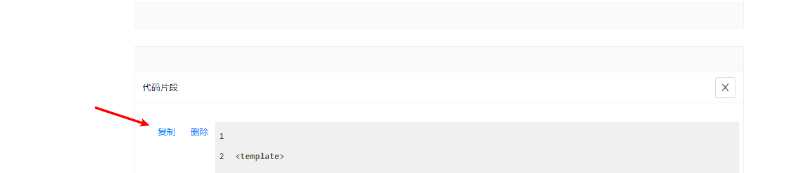

所有记事内容一次性加载

# 新建笔记

光标优先定位到标题输入框

## 标题背景色

提供默认、红色、绿色三种,后面两个是为了区分优先级,在滚动的过程中方便快速捕捉,应保持唯一或少用。

## 标题

如果不填写则默认为当前时间,但不建议这么做,要记录的事情应分门别类,这样才能提高效率。

标题提供搜索功能,如果选择已存在的标题,其内容也会被同步,此时按编辑算,再更改标题不会覆盖内容。

点击标题部分可复制

## 内容

### 添加代码

将代码放在 \`\`\` 和 \`\`\`中间即可

### 超链接

如果是 url 则会显示为超链接,点击会在新窗口打开,超出 60 个字符的部分会被截取

### 图片

支持黏贴截图,支持拖拽图片。

用户操作的图片会被转换成 base64 存储在磁盘上,编辑记事本时会展示为特定的格式,例如 base64img://95305.png,在其它记事中一样可以使用

如果是网络图片且后缀带有.jpg"、".jpeg"、".gif"、".png"、".svg",会直接显示图片,最大高度为 300px

点击图片可全屏显示

# 编辑记事本

标题可更改,但不提供筛选功能

# 关于搜索

## 标题模式

只显示标题,再次点击恢复原样

可单独展开

## 搜索内容

默认显示所有标题,也可搜内容,可多选

# 关于复制

复制整个记事内容

复制部分内容

# 关于删除

直接点击删除按钮,没有二次确认

为了防止误删,程序会先加一个`deleted:true`的标识,打开 notes.json 去掉该标识就可以在界面显示了

默认会存储 50 个,超过这个数,程序则把第一个被删除的记事从 notes.json 移除

delNote.js 的 `svceDeletedNotesCountThreshold`记录了这个值,可以进行修改

## 删除部分内容

考虑到一个记事会有多个任务,提供了删除部分内容的能力

# 关于位置

通过底部新建按钮添加的会出现在第一个

也可以选择"向上添加"、"向下添加"、"置顶"、"置后"

# 常见问题

## 加载列表缓慢

### 过多的图片

因为黏贴的图片是转换为 base64 存储的,比较占内存,已现在机器的处理速度,实际使用时不容易发生。

### 假删除导致

为了防止误删,程序会存储一定长度的记事本,可点击"清空删除备份"按钮"彻底删除

### 出现用户想要删除但实际上一直保留的内容

这一类问题是程序 bug,只能对比展示给用户的和实际存储的有哪些差异来决定,之前就曾修复用户单独删除了图片但这个图片却越积越多,从而导致加载缓慢。
