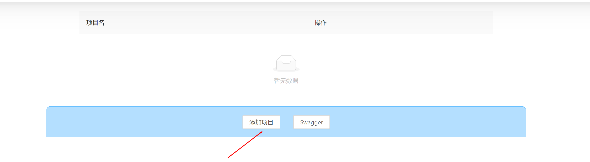
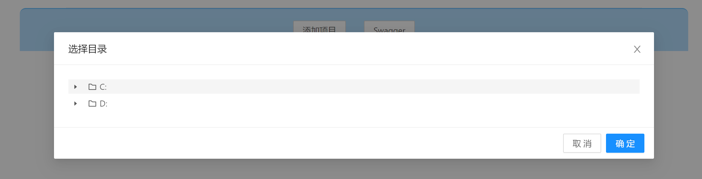
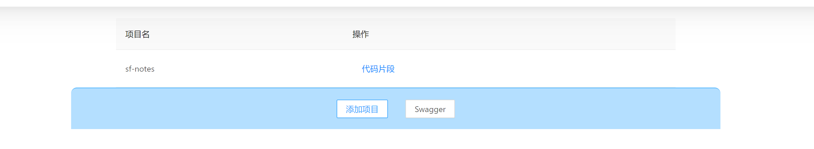
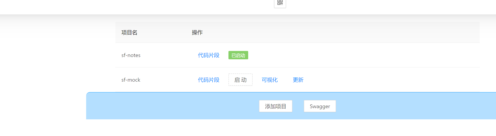
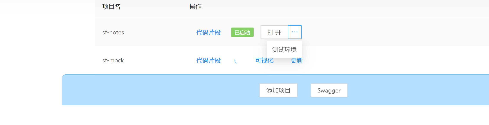

后端脚本实现依赖与平台,只在 windows 上测试过

默认会添加自身到项目列表

启动、多环境联调等功能依赖于 sf-mock 项目,[使用文档](https://github.com/xiaodun/sf-mock)

# 添加项目



选择项目目录

可以打开 project.json,修改`addBasePath`属性改变起始目录



如果 sf-mock 没有添加,则效果如下



添加 sf-mock 项目

在此之前应阅读[sf-mock 教程](https://github.com/xiaodun/sf-mock/blob/main/README.md) , tutorial 文件下的 4、9 节



项目启动实则是后端脚本执行 bat 文件,这些 bat 文件又是根据 programConfig.js 里的配置,然而 sf-mock 项目启动逻辑是写在脚本里的,所以只需要点击"可视化",再点击"批量生成启动项目 bat 文件"

此操作相当于进入 sf-mock 项目的 generate\WindowsTerminal 目录,执行 creatBatForWindowsTerminal.js


再点击"启动" 就会同时启动 mock 服务器和 nginx,启动的脚本依赖于 WindowsTerminal,[如何下载](https://juejin.cn/post/6980363931390836749)

"更新"只是从新读取了一下 programConfig.js

## 多环境联调

sf-mock 的 programConfig.js 有如下配置

```
    "sf-notes": {
      programUrl: "http://localhost:8000",
      addressPath: "",
      WindowsTerminal: {
        isOpen: true,
        tabList: [
          {
            withCreateAllBat: true,
            withCreateSingleBat: true,
            address: `D:\\github\\sf-notes`,
            startCommad: "npm run dev",
            isSelf: true,
          },
          {
            withCreateAllBat: true,
            withCreateSingleBat: true,
            address: `D:\\github\\sf-notes\\service\\app`,
            startCommad: "node service.js",
            titleName: "notes-service",
          },
        ],
      },
      withFileStructure: false,
      withNginxConfig: false,
    }
```

程序通过`programUrl`属性知道 sf-notes 项目已启动,当然 sf-notes 肯定是启动了的,不然看不到这个列表。当标签隐藏然后被显示，会自动检测`programUrl`。

如果想要给 sf-notes 弄一套 mock 环境,就需要去掉`withFileStructure`,使其能够参与 mock 数据结构的生成,要去掉`withNginxConfig`,使其能参与 nginx 配置的生成

增添如下配置

```
      apiPrefixList: ["/api"],
      serverList: [
        {
          port: 9011,
          isMock: true,
        },
        {
            port:"9012",
            name:"测试环境",
            url:"http://baidu.com.com"
        }
      ],
```

点击"可视化",点击"批量生成项目文件结构", 相当于进入 sf-mock 项目的 generate 目录,执行 createFileStructure.js

点击"重启 nigix",此操作相当于进入 sf-mock 项目

- 进入 nginx-1.19.6,运行 killNginx.bat

- 进入 generate 目录,执行 writeNginxConfig.js

- 进入 generate 目录,启动 nginx

回到项目列表页,点击"更新",此时 sf-notes 会多出"打开"下拉菜单



直接点击"打开"按钮就是在 mock 环境打开,也就是 9011 端口,所有/api 的请求都会被转到 mock 服务器

同时可以配置多个环境,9012 端口访问,则所有/api 的请求都会被转到配置的 url

会自动将项目的本地连接放在项目列表里


# 快捷访问 gitlab

通过`project.json`文件中的，`config.gitlabBasePath`字段，示例值"http://10.200.0.140"，程序就会自动拼接，方便跳转


- 去主页
- 创建合并
- 处理合并

# ip/域名

sf-mock 增加了新功能，为每一个项目对应的环境生成一个域名，增强区分性，例如"http://wx.mock.sf-notes:9010/home/index"、"http://wx.test.sf-notes:9010/home/index"

sf-notes 做了这个功能的接入


"ip"、"域名"的选择会影响打开链接的拼接规则

如果域名不能访问，可能是"C:\\Windows\\System32\\drivers\\etc\\hosts"没有写入权限所致，可以单独执行 writeNginxConfig.js 看看有无报错。

# 拖动排序

不同阶段每个项目的优先级是不一样的，因此新增了拖动排序功能

通过`project.json`文件中的，`config.nginxVisitWay`字段决定默认值，分别是"ip"、"domain"


