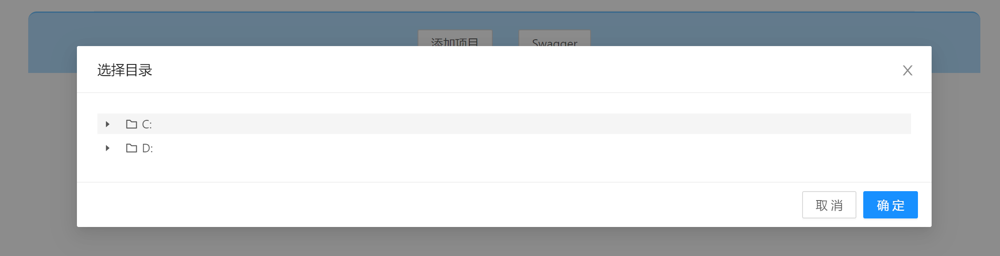
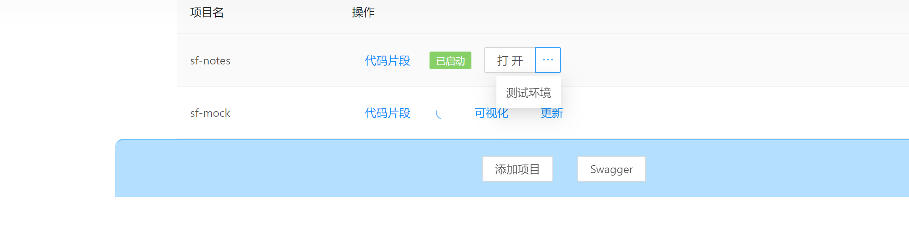

后端脚本实现依赖与平台,只在 windows 上测试过

# 添加项目




点击确定后会记录这次打开的路径，并在下一次添加时候自动展开

## 配置

点击配置按钮可以配置多条启动命令 以及 项目运行地址，配置好后会监听是否启动，未启动则出现启动按钮。


再点击"启动" 就会同时启动 mock 服务器和 nginx,启动的脚本依赖于 WindowsTerminal,[如何下载](https://juejin.cn/post/6980363931390836749)

"更新"只是从新读取了一下 programConfig.js

## 多环境联调

sf-mock 的 programConfig.js 有如下配置

增添如下配置

```
      apiPrefixList: ["/api"],
      serverList: [
        {
          port: 9011,
          isMock: true,
        },
        {
            port:"9012",
            name:"测试环境",
            url:"http://baidu.com.com"
        }
      ],
```

点击"可视化",点击"批量生成项目文件结构", 相当于进入 sf-mock 项目的 generate 目录,执行 createFileStructure.js

点击"重启 nigix",此操作相当于进入 sf-mock 项目

- 进入 nginx-1.19.6,运行 killNginx.bat

- 进入 generate 目录,执行 writeNginxConfig.js

- 进入 generate 目录,启动 nginx

回到项目列表页,点击"更新",此时 sf-notes 会多出"打开"下拉菜单



直接点击"打开"按钮就是在 mock 环境打开,也就是 9011 端口,所有/api 的请求都会被转到 mock 服务器

同时可以配置多个环境,9012 端口访问,则所有/api 的请求都会被转到配置的 url

会自动将项目的本地连接放在项目列表里


# 快捷访问 gitlab

通过`project.json`文件中的，`config.gitlabBasePath`字段，示例值"http://10.200.0.140"，程序就会自动拼接，方便跳转


- 去主页
- 创建合并
- 处理合并

# ip/域名

sf-mock 增加了新功能，为每一个项目对应的环境生成一个域名，增强区分性，例如"http://wx.mock.sf-notes:9010/home/index"、"http://wx.test.sf-notes:9010/home/index"

sf-notes 做了这个功能的接入


"ip"、"域名"的选择会影响打开链接的拼接规则

如果域名不能访问，可能是"C:\\Windows\\System32\\drivers\\etc\\hosts"没有写入权限所致，可以单独执行 writeNginxConfig.js 看看有无报错。

# 拖动排序

不同阶段每个项目的优先级是不一样的，因此新增了拖动排序功能

通过`project.json`文件中的，`config.nginxVisitWay`字段决定默认值，分别是"ip"、"domain"


# 页面导航

在 PC 端页面底部增加了“返回”按钮，点击可快速返回主页。为了保持界面简洁，该按钮在移动端会自动隐藏。
