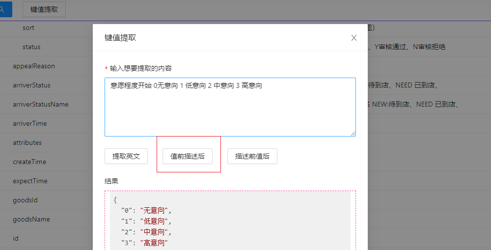

后端接口自带的 Swagger 界面使用起来并不顺手,几个突出问题如下:

- 只有后端服务发了,文档才会生成,会出现用着用着就不行了的情况

- 渲染信息不够简洁

- 无法扩展功能


# 录入


需要填写一个可以访问的 Swagger 链接,包含域名就可以了

"新增" 单选项如果存在相同的域名还是会覆盖原有

"覆盖" 用于不同环境


# 路径菜单

程序会将所有分组显示在一起,并支持多个域名


可以选择标签、单个接口


## 搜素


如果一个接口的信息中包含搜素内容就会展示

## 关注

右侧"关注"按钮,通过关注面板打开才会有"取消关注按钮"


批量关注会处理所有选择的接口


在关注面板中不会区分域名、分组

如果有多个标签则会区分


单个标签所有关注的接口一起展示


# 生成 ajax 代码

每次都要将后端脚本映射到项目里,程序支持为每个项目编写固定脚本来批量生成


project.json 的 projectList 中,给项目添加`"closeAjaxCode": true,`可使得其不出现在左侧


程序会打开上一次"设为默认"(没有则第一个)的项目,每次切换项目,都会去执行[项目名]-ajax-code.js,没有则创建,默认内容如下:

```
(function () {
  return function (checkedPathList, apiPrefixs, external) {};
})();


```

示例如下

```
(function () {
  return function (checkedPathList, apiPrefixs, external) {
    let ajaxCodeWrapList = [];
    let pathStatement = {
      name: "路径声明",
    };
    pathStatement.data =
      checkedPathList
        .map((item) => {
          let pathName = external.getPathName(item.pathUrl, true);
          let prefix = external.getPathPrefix(item, apiPrefixs);
          let url = prefix + item.pathUrl;
          let methodTransform = {
            post: "postJSON",
            get: "get",
          };

          return `
                      {
                        name:"${pathName}",
                        url:"${url}",
                        method:"${methodTransform[item.data.method]}",
                        desc:"${item.data.summary}"
                      }`;
        })
        .join(",\n") + ",\n";
    ajaxCodeWrapList.push(pathStatement);
    return ajaxCodeWrapList;
  };
})();
```

external.getPathName 会取路径的最后一个单词 A。当组成 A 的字符都是小写且第二个参数为`true`时,则会采用倒数第二个+A(第一个字符大写)形式返回

external.getPathPrefix 得到路径的前缀

# 未匹配到的接口

当 swagger 文档更新时,可能出现一些关注的接口不见了,这时左侧菜单会打上失效标签,右侧会渲染"没有匹配到接口数据格式"

# 右侧信息

## 前缀

一些接口存在特殊的前缀,但是在文档里又没有明确的展示出来,程序支持配置来记忆这件事

打开 project.json,在 apiPrefixs 属性中配置

```
域名:{
    分组名:{
        "前缀":[
            接口前缀,程序会以此匹配哪些接口有前缀
        ]
    }
}
```

域名支持正则

```
        "http://wenwo-cloud-adapter-doctor-(rebuild-test)|(test).wenwo.cn": {
            "patient-H5": {
                "/api/gateway/doctor": [
                    "/p/h5"
                ]
            },
```

没有前缀

```
        "http://wenwo-cloud-adaptor-biz-domain-community-rebuild-test.wenwo.cn": {
            "default": {
                "": [
                    "/bizc"
                ]
            }
        },
```

"前缀"的显示有三种

- "没有配置前缀",红色字体
- "没有前缀",在 apiPrefixs 配置中明确标识没有前缀,绿色字体
- 配置的前缀

## 路径

显示接口路径,提供了"复制"按钮,如果有前缀,则有"带前缀复制"按钮

## 描述

显示对接口的描述,用蓝色显示

## 被关注的接口

额外显示域名、分组、标签


## 请求参数

### 复制功能

根据请求参数的的结构生成 js 对象,并根据属性的数据类型赋初值,默认规则如下

- 数组初始化为`[]`
- 对象初始化为`{}`
- 布尔值随机为`true`或`false`
- 数字初始化为 0
- 普通字符串初始化为`""`
- 是字符串且是枚举的初始化为`null`,涉及后台枚举转换错误

可打开 copySwaggerData.js 做修改

无需传参时的展示


## 列表渲染

相比默认的 swagger 文档,少了请求类型列,是否必须列, 数据类型和 schema 合并了,去掉了用中文表达数据结构,都展示为 Array、Object

### 名称列

点击可复制

如果是必传参数,则会在属性前面用一个红色、加粗的星号。

### 描述列

- 不会缩略展示
- 点击可复制
- 没有描述时会用蓝色字体显示"没有描述"

#### 枚举

对于枚举类型 Swagger 文档只是提供了 enum 属性承载,但没有对应的中文,通常后端会以特定的形式给出,例如:【DOCTOR:医生 COMMUNITY:社区】,因此页面默认不会再把所有枚举值渲染出来,可通过 project.json 的 showEnumList 属性修改默认行为

可以使用"键值提取"快速为枚举生成模板代码





生成代码(JavaScript)如下:

```
(function () {
  let obj = {
    DOCTOR: "DOCTOR",
    COMMUNITY: "COMMUNITY",
  };
  obj.selectOptionList = [
    {
      label: "医生",
      value: obj["DOCTOR"],
    },

    {
      label: "社区",
      value: obj["COMMUNITY"],
    },
  ];
  obj.getLabel = (key) => {
    const data = obj.selectOptionList.find((item) => item.value == key);
    if (data) {
      return data.label;
    }
    return key;
  };

  return obj;
})();


```

是一个自执行函数,包含以下功能

- 键值映射
- 对应中文描述
- 支持通过 key 查询中文描述

扩展匹配规则(增加分隔符)、生成其它格式(TypeScript)可改动 keyValueExtraction.js

# 类型

- enum 用橙色标记

- Array<>形式用红色标记 ,列如 Array\<string\>

- 普通类型用黑色显示 string、object、int64、date-time 等

## 返回格式

没有返回时


这里起警示作用,因为后端肯定是要有返回,没有明确表明便可能存在潜在问题

### 通用复制

根据格式赋予默认值,方便 sf-mock 使用,规则如下

- boolean 类型在 true 和 false 中随机
- integer 赋值 0
- 普通的 string 类型赋值字段名
- date-time 的 string 赋值当前时间
- 枚举的 string 随机选一个类型赋值

可以在 copySwaggerData.js 中修改默认行为

### 根据项目复制

通过下拉列表的形式展示所有已加入的项目,会记录最新的选择,点击复制则会在生成

generateMockDataWithProject.js,功能与"复制"保持一致,参数中携带项目名,可自行修改。
