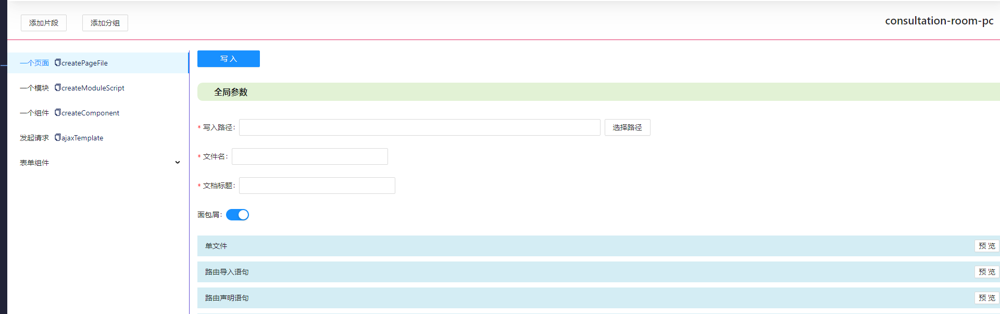
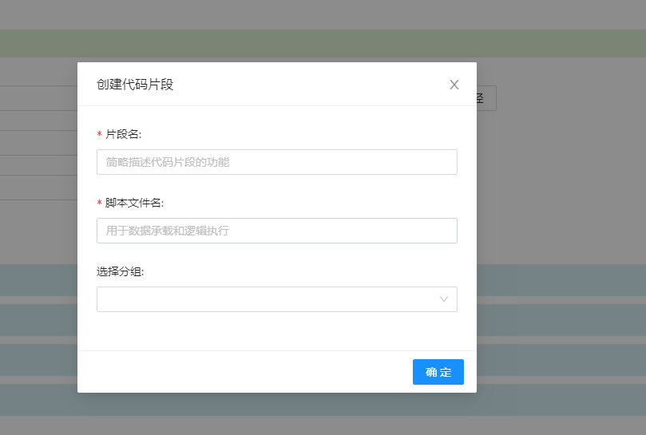
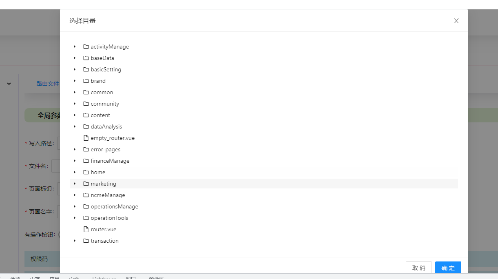
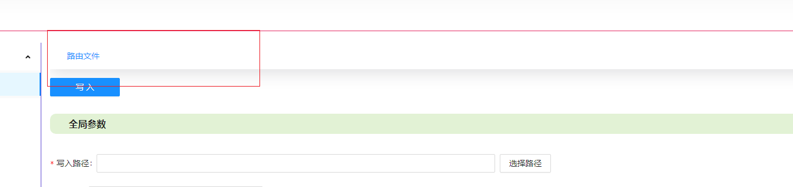

当一个项目封装琐碎、写法多样前端该怎样处理现状? 优化封装虽然时必修的功课,但一些功能只是设计不太合理,想要收回重写的成本时间周期太长。

即便有一个封装很周到的项目,一些基本操作也难以避免,比如文件的创建、组件的导入,有的页面拥有共同的特性,重复的操作令人心生厌倦。

"代码片段" 功能首先提供了静态代码管理的功能。要想做到更智能,可以创建一个模块,像不同的文件写入代码则要熟练掌握 node.js 的 IO 能力、babel 解析语法等




# 添加分组

优先考虑"添加分组",更好的管理相同类型但不同参数的代码片段,从而避免在一个脚本中存在太多逻辑判断。


分组名不可重复

# 添加片段



- 片段名 是描述功能

- 脚本文件名 是承载代码执行逻辑,建议使用英文

点击"确定"按钮后,在 snippet 下会议项目名创建文件夹,并创建 '脚本文件名'-'项目名'的 js 文件

默认内容如下

```
(function () {
  return function (argParams) {
    const _ = require("lodash");
    const prettier = require("prettier");
    const path = require("path");
    const fs = require("fs");
    const babelParser = require("@babel/parser");
    const { default: babelTraverse } = require("@babel/traverse");
    const { baseParse: vueParse } = require("@vue/compiler-core");

    function getBaseNameInfo() {
        return {
            routeFilePath:path.join(argParams.writeOsPath, "router", "index.js");
        }
    }
    return {
      writeOs: {
        open: true,
        needFolder: true,
        basePath: "\\src\\modules",
      },
      globalParamList: [
        {
          name: "fileName",
          label: "文件名",
          type: "input",
          style: {
            width: 300,
          },
          require: true,
        },
        {
          name: "hasCrumb",
          label: "面包屑",
          type: "switch",
          defaultValue: true,
        },
      ],
      fragmentList: [
        {
          title: "单文件",
          getTemplate() {
            return "";
          },
          writeOs(template) {},
        },
      ],
    };
  };
})();

```

- argParams 用户传入的参数

- lodash 对用于命名格式的转换

- path 用于路径的拼装

- fs 多用于文件的读取和写入、文件夹创建等

- prettier 用于格式化代码

- babelParser 把文件内容转化未语法树

- babelTraverse 通过遍历语法树查到某个节点的位置,从而实现将代码片段写入到文件

- vueParse 解析 vue 单文件

- getBaseNameInfo 多个片段用到相同变量的概率很大,建议一开始就统一声明

## 参数配置说明

### globalParamList

### writeOs

程序封装了通用的写入逻辑

#### open

是 true 则会出现"写入"按钮,点击按钮会检验必填参数

- needFolder 为 true,则通过验证后会弹出选择路径的弹窗

- usePathChoose 路径变成必填参数出现在参数里


选择的路径以"writeOsPath"传给脚本,可以根据这个参数去推断其它关联文件夹的位置,从而创建文件夹等

如果项目中不同的模块不具备统一的位置规律,也可通过"writeOsPath"组件判断,从而做出不同的响应



#### basePath

只需要基于项目根路径配置即可,决定了选择文件的起始路径

### openFileList

示例

```
      getOpenFileList() {
        return [
          {
            name: "路由文件",
            path:
              argParams.writeOsPath &&
              path.join(argParams.writeOsPath, "dynimicRouter", "index.ts"),
          },
        ];
      },
```

诚然,获得抽象语法树、解析、写入文件这一系列操作在前期会耗费很多时间,也会存在无法确定写入到哪里的问题,这里提供一个折中方案。

返回的路径在前端展示为



点击之后就会在 VScode 打开这个文件,对于一些层次较深且命名唯一性不强的文件是能简化操作的

注意实例中依赖了 writeOsPath 需要先选择路径才能正确打开
