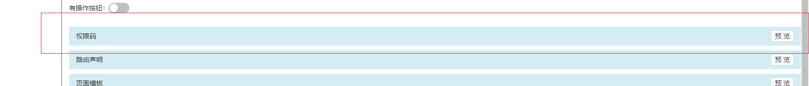
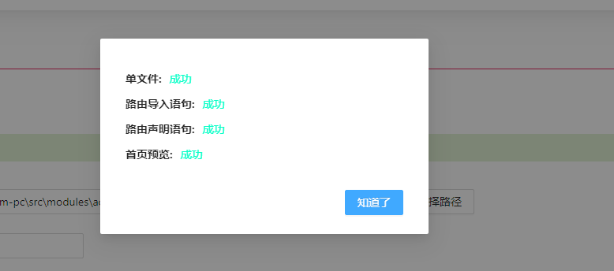

已内置项目自身的代码片段

createTableModule-sf-notes.js 快速创建一个应用的基本文件结构，参考输入：模块名-klo，应用名-尝试，位置-2

当一个项目封装琐碎、写法多样时,前端该怎样处理现状? 优化封装虽然是必修的功课,但一些功能只是设计不太合理,且存量较大,想要收回重写成本的时间周期太长。

即便有一个封装很周到的项目,一些基本操作也难以避免,比如文件的创建、组件的导入、无法封装的过程代码等。很多页面拥有共同的特性,重复的操作令人心生厌倦。

"代码片段" 功能首先提供了静态代码管理功能。要想做到更智能,实现向不同的文件写入代码则要熟练掌握 node.js 的 IO 能力、babel 解析语法等


# 添加分组

优先考虑"添加分组",更好的管理相同类型但展现方式不同的代码片段,从而避免在一个脚本中存在太多参数展示逻辑的判断。


分组名不可重复

# 添加片段


- 片段名 是描述功能

- 脚本文件名 是承载代码执行逻辑,建议使用英文

点击"确定"按钮后,在 snippet 文件夹下会已项目名创建文件夹,并创建 "[脚本文件名]-[项目名]"的 js 文件

默认内容如下

```
(function () {
  return function (argParams) {
    const _ = require("lodash");
    const prettier = require("prettier");
    const path = require("path");
    const fs = require("fs");
    const babelParser = require("@babel/parser");
    const { default: babelTraverse } = require("@babel/traverse");
    const { baseParse: vueParse } = require("@vue/compiler-core");

    function getBaseNameInfo() {
        return {
            routeFilePath:path.join(argParams.writeOsPath, "router", "index.js")
        }
    }
    return {
      writeOs: {
        open: true,
        needFolder: true,
        usePathChoose:fasle,
        basePath: "",
      },
      globalParamList: [
        {
          name: "fileName",
          label: "文件名",
          type: "input",
          style: {
            width: 300,
          },
          require: true,
        },
        {
          name: "hasCrumb",
          label: "面包屑",
          type: "switch",
          defaultValue: true,
        },
      ],
      fragmentList: [
        {
          title: "单文件",
          getTemplate() {
            return "";
          },
          writeOs(template) {},
        },
      ],
    };
  };
})();

```

- argParams 用户传入的参数

- lodash 多用于命名格式的转换

- path 用于路径的拼装

- fs 多用于文件的读取和写入、文件夹创建等

- prettier 用于格式化代码

- babelParser 把文件内容转化为 AST 抽象语法树

- babelTraverse 通过遍历语法树查到某个节点的位置,从而实现将代码片段写入到文件

- vueParse 解析 vue 单文件

- getBaseNameInfo 不同片段用到相同变量的概率很大,建议一开始就统一声明

# 参数配置说明

## globalParamList

此处配置决定了"全局参数"的展示

```
{
    name: "fileName",
    label: "文件名",
    type: "input",
    disabled:true,
    defaultValue:"123"
    style: {
      width: 300,
    },
    props:{
      placeholder:"提示语"
    }
    require: true,
},
```

- name 是传给后端脚本的参数名,
- label 是前端展示的描述名
- style 对应 Antd 组件的 style 属性
- props 对于 Antd 组件支持的属性
- require 表示是否必填
- openChangeRequest 当值发生变化后是否重新请求配置,用于不同参数间的组合,默认 false
- defaultValue 默认值
- disabled 是否禁用,默认 fasle

  

### name 是 "\_uniqueId"

有时候前端写代码时后端还没有接口文档,则可以通过这个参数来去区分相同类型的组件,当必填参数发生变化时它会自动变化

```
{
  name: "_uniqueId",
},

```


### type 是 number


### type 是 switch


#### type 是 select

```
  {
    valueList: ["长沙"],
  }
```

```
  valueList: [
    {
      label: "长沙",
      value: 123123,
    },
  ],
```


## fragmentList

代码片段的一个集合,单个示例如下:

```
{
  title: "单文件",
  getTemplate() {
    return "";
  },
  writeOs(template) {},
},
```

对应的前端展示为:



### getTemplate

没有该方法则不会有预览按钮

当点击"预览"则会验证表单,通过后调用 getTemplate 方法,并将会内容复制到剪贴板

### writeOs

当点击"写入"按钮,表单验证通过则会依次调用每个片段的 writeOs 方法,`template`形参就是 getTemplate 方法返回的结果,并向前端返回结果



每个片段的写入结果有三种情况:

- 用绿色字体标记的"成功"

- 没有 writeOs 方法则用红色字体标记"不支持写入"

- 执行 writeOs 失败则用红色字体标记错误信息

## writeOs

### open

是 true 则会出现"写入"按钮,点击按钮会检验必填参数

- needFolder 为 true,则通过验证后会弹出选择路径的弹窗

- usePathChoose 路径变成必填参数出现在全局参数里


选择的路径已`writeOsPath`传给脚本,可以根据这个参数去推断其它关联文件夹的位置,从而创建文件夹等


### basePath

只需要基于项目根路径配置即可,决定了选择文件的起始路径

## getOpenFileList() {

示例

```
      getOpenFileList() {
        return [
          {
            name: "路由文件",
            path:
              argParams.writeOsPath &&
              path.join(argParams.writeOsPath, "dynimicRouter", "index.ts"),
          },
        ];
      },
```

诚然,获得抽象语法树、解析、写入文件这一系列操作在前期会耗费很多时间,也会存在无法确定写入到哪里的问题,这里提供一个折中方案。

返回的路径在前端展示为


点击之后就会在 VScode 打开这个文件,对于一些层次较深且命名唯一性不强的文件是能简化操作的

注意示例中依赖了`writeOsPath`需要先选择路径才能正确打开
