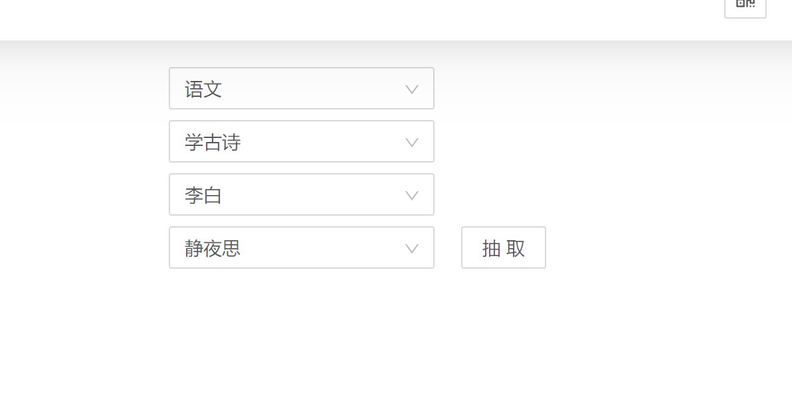

任务的添加在 activity.json 中进行

示例结构如下

```
[
  {
    "name": "语文",
    "children": [
      {
        "name": "学古诗",
        "children": [
          {
            "name": "李白",
            "children": [
              {
                "name": "静夜思"
              },
              {
                "name": "蜀道难"
              }
            ]
          }
        ]
      }
    ]
  }
]

```



一个层次下有多个选项就会有抽取按钮

还有几个不常用的属性

- isClose 表示不参与抽选
- weight 表示权重,值越高越有机会被抽取
- tips 阐述说明当前选项
