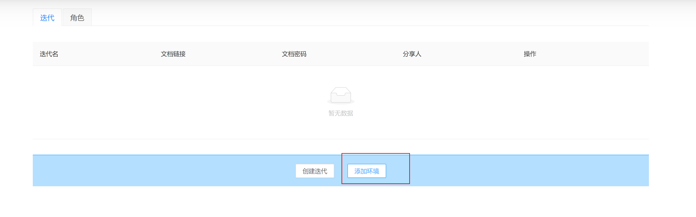
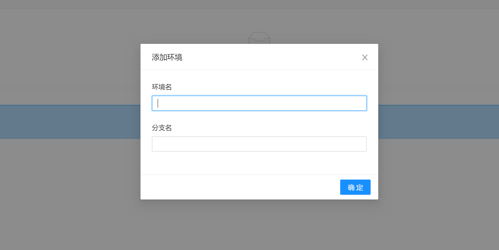
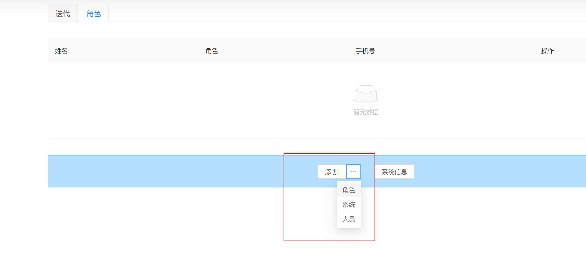
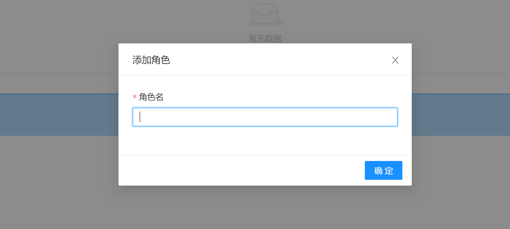
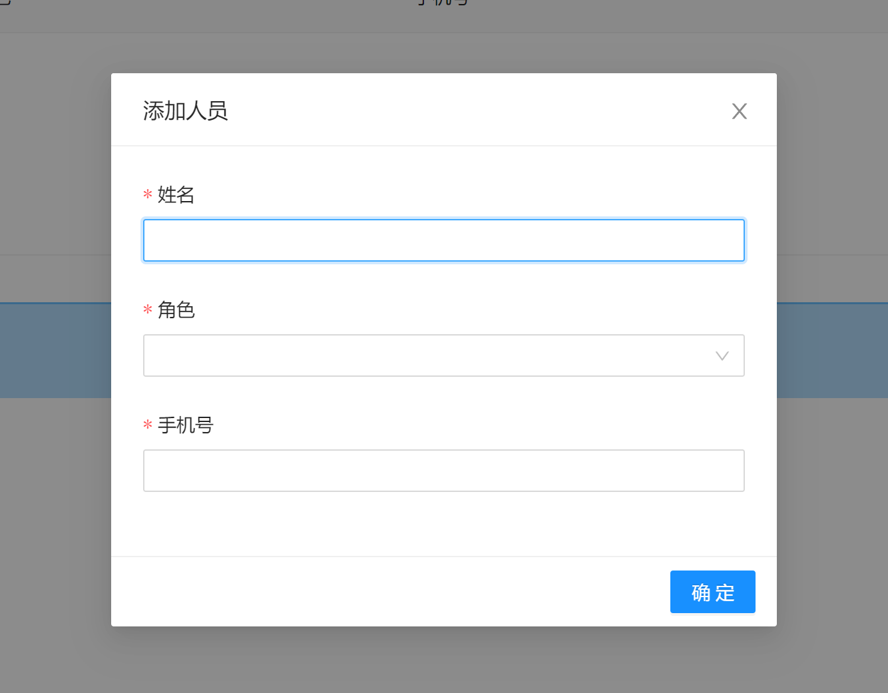
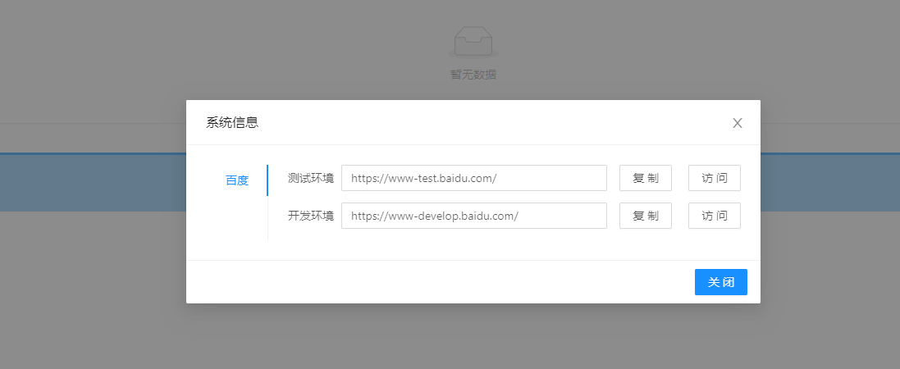
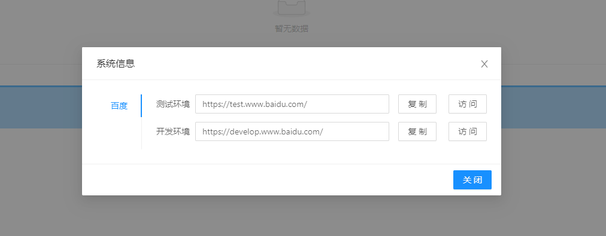
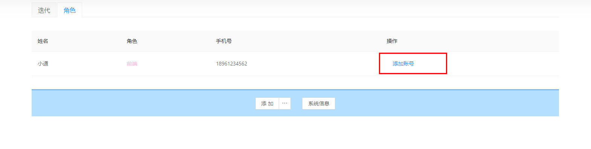
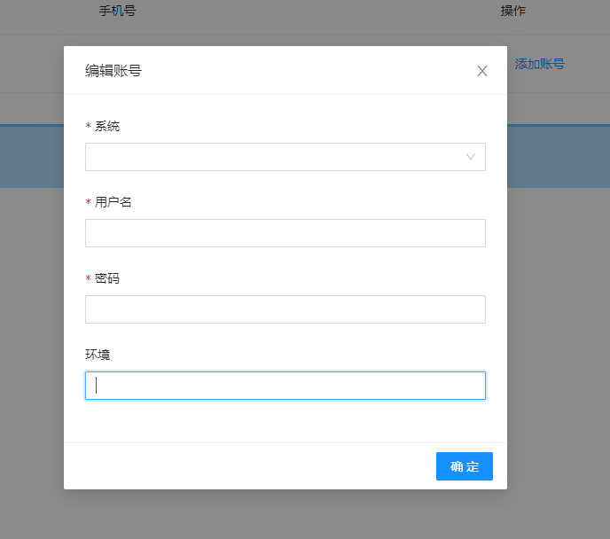
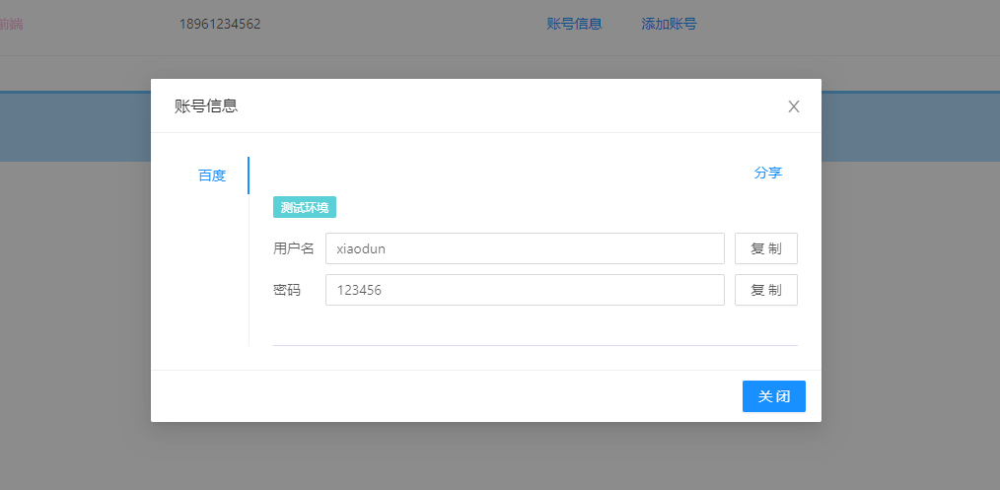

一个迭代开发中涉及到很多资源

# 添加环境

这里面加入的是 git 分支信息,一个分支对应一个环境

# 添加角色

比如产品、前端、开发这些

# 添加人员

这个添加手机号主要为了发送钉钉通知的

# 添加系统

如果有多个环境,那么程序会根据环境信息自动计算访问地址

如果不是在头部添加，点击系统信息

在头部添加则会展示

如果这两条规则不能满足需要,可以打开`service\app\data\api\iterative\iterative\lifeCycle.js`,修改`getEnvUrl`方法的逻辑

# 添加账号

可以记录每个人的账号信息

;

# 账号信息

添加一个账号之后就能看到此按钮,点击之后是一个把所有账号汇总的模态框

如果想要删除、修改信息可以打开 iterative.json 文件

当然录入上述基本信息还可以为其它功能开发做准备,比如运维系统,每个公司都不太一样,涉及到登录就可以筛选出特定的账号密码。
