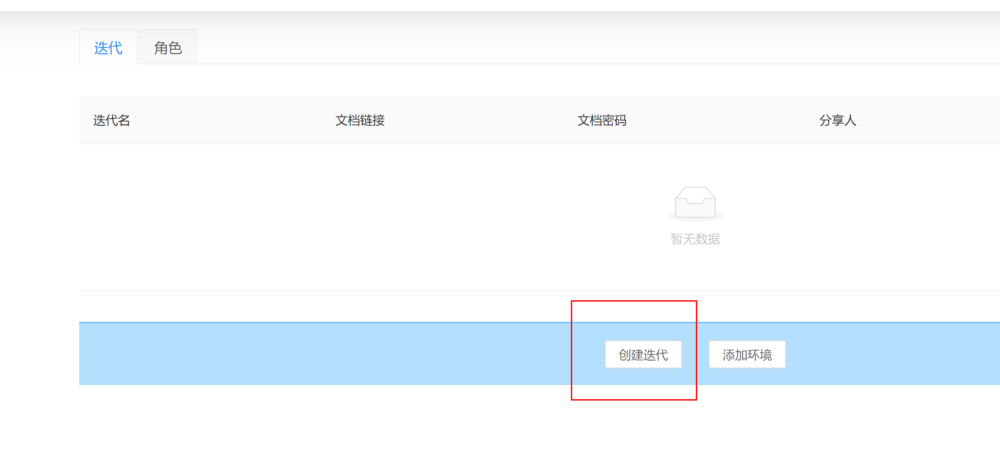
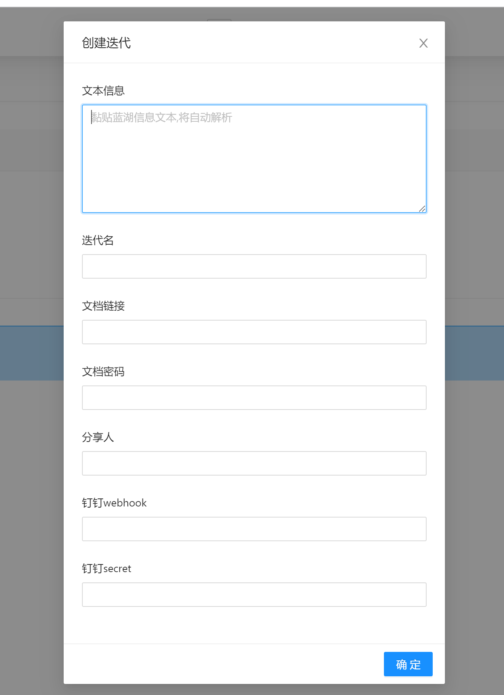
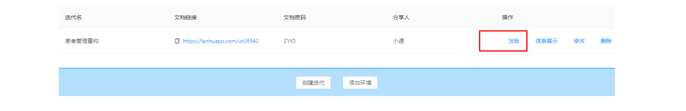
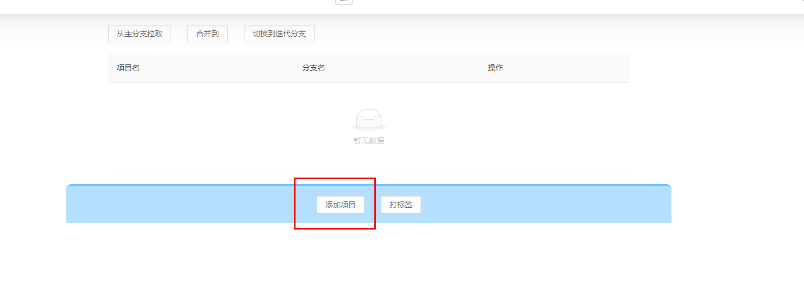
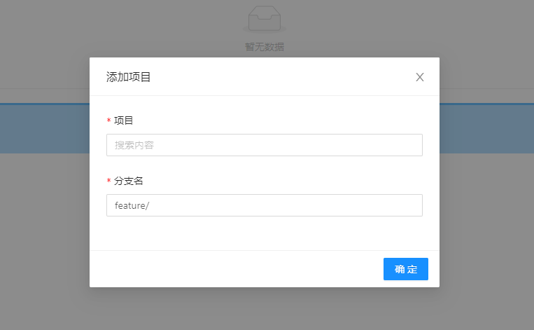
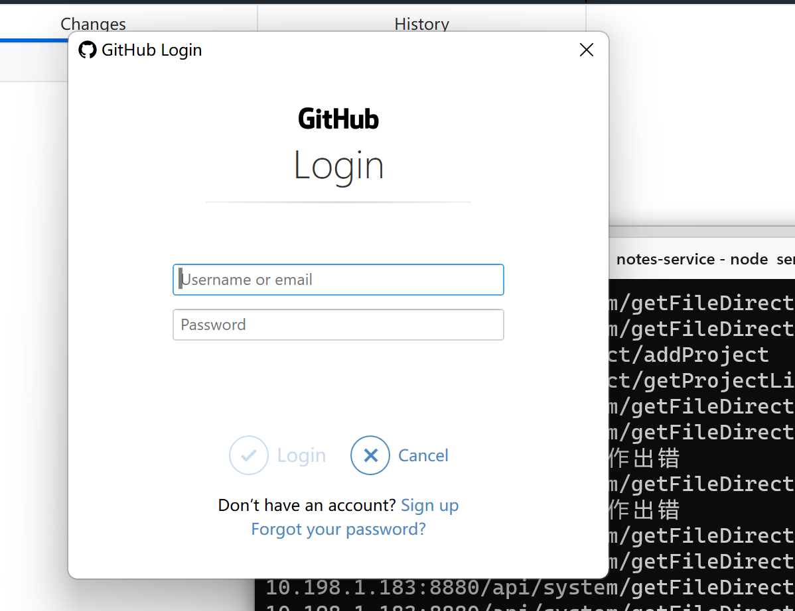
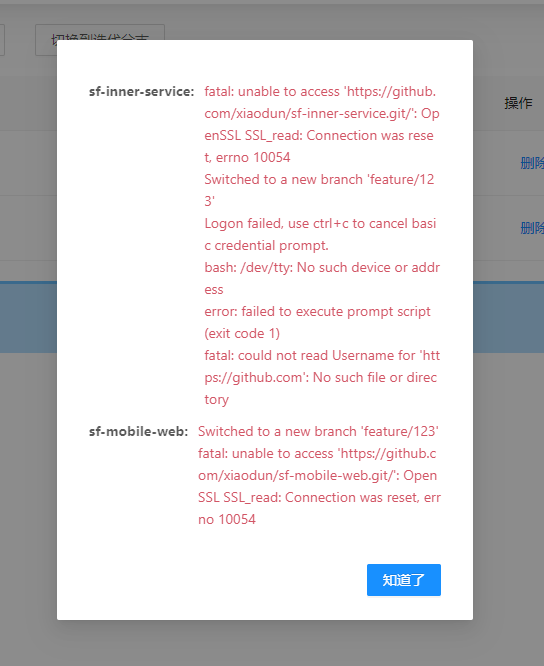
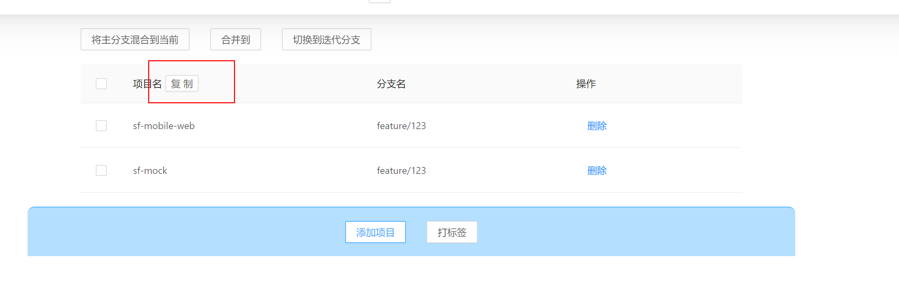
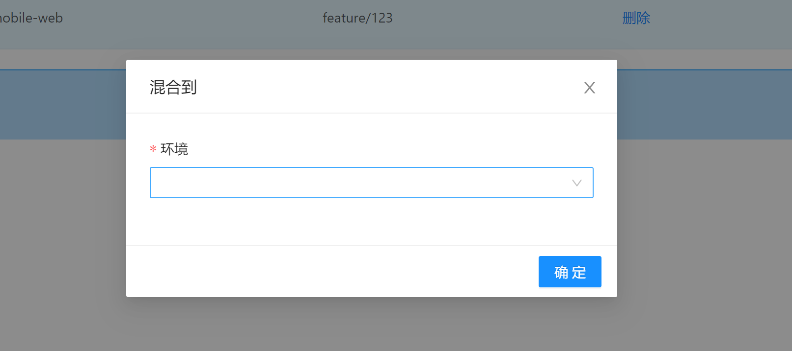

# 创建迭代

从钉钉复制产品发的蓝湖文档信息,黏贴到"文本信息",就会自动解析"迭代名"、"文档链接"、"文档密码"、"分享人"

其中"钉钉 webhook"、"钉钉 secrt"只有在群里添加自定义机器人才能获得

# 发版

一个迭代对应一个"发版页面"

## 添加项目

其中"项目"数据来源于"项目管理"模块,可以选择多个

分支名默认填充了"feature/",可以在 iterative.json=>gitConfig=>newBranchDefaultPrefix 中修改

点击确定后会执行真实的 git 命令操作,等同于

- 当前分支就是迭代分支则跳过

- 不是 master 分支,则执行`git checkout master`
- 拉取远程代码(GithubDesktop 直接创建分支则不会拉取远程分支) 执行 `git pull`
- 创建分支 执行`checkout -b ${item.branchName}`
- 推送分支 `push --set-upstream origin ${item.branchName}`

第一次执行会要求登录

会返回执行结果,因为这些命令不管是成功还是失败都会返回一些信息

实际上添加成功了,但推送到远程失败了,我在公司使用时没这个问题

多个项目则会出现多选框

### 从主分支拉取

执行 git 命令如下

- 当前分支不是 master,`checkout master`

- 拉取主分支 `pull`

- 切换到特性分支 `checkout ${item.branchName}`

- 混合 master `merge master`

- 推送 `push`

- 检测冲突 `diff --name-only --diff-filter=U"`

前端会提示检测冲突,有冲突则可以在 VSCode 打开冲突文件,否则回到迭代分支

### 合并到

先选择要合并到的分支,这个操作会被记录

执行 git 命令如下

- 切换到要合并的分支`checkout ${branch}`
- 拉取当前分支 `pull`
- 混合特性分支 `${item.branchName}`
- 推送代码 `push`

会检测冲突,有冲突则可以在 VSCode 打开文件,没有冲突则可以切换到迭代分支

### 切换到迭代分支

执行 git 命令如下 `checkout ${item.branchName}`

注意,如果上一个执行命令执行失败,下一个也不会成功,比如合并代码时候有冲突是无法提交成功的

上述功能在一切正常的情况下体验是最好的,一旦发生问题,还是要借助 git 工具,但对于日常开发,冲突也是不常见的

## 打标签

记录一下使用的环境

