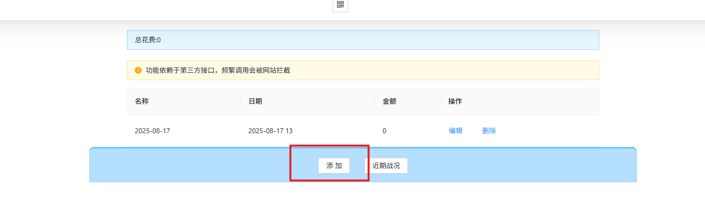
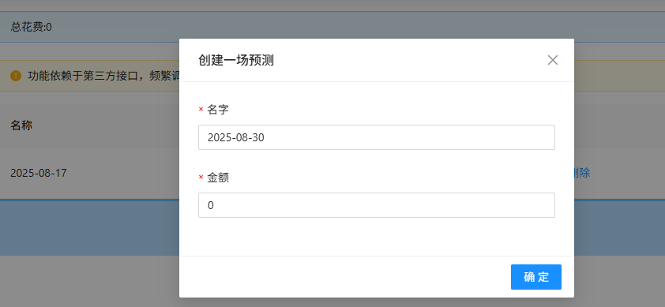
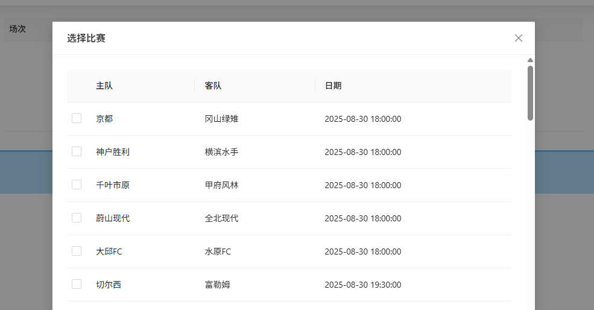
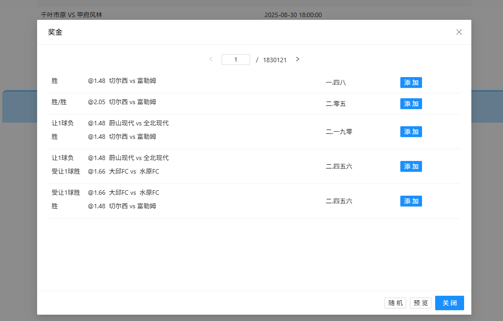
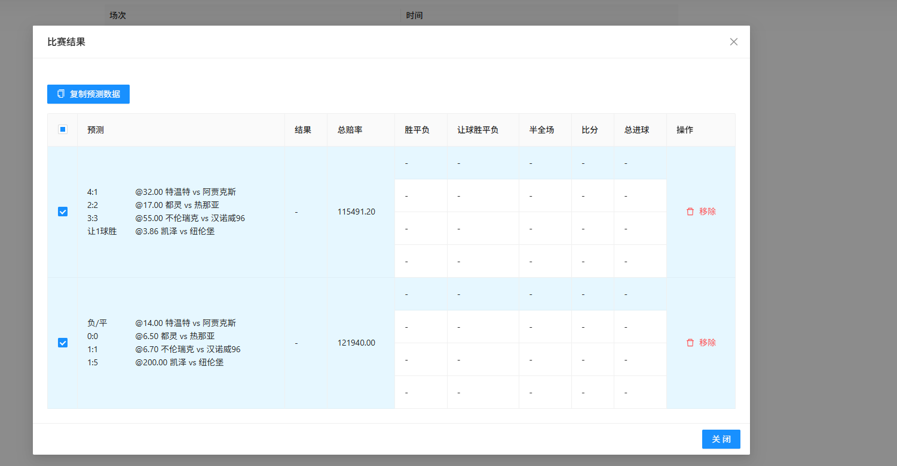
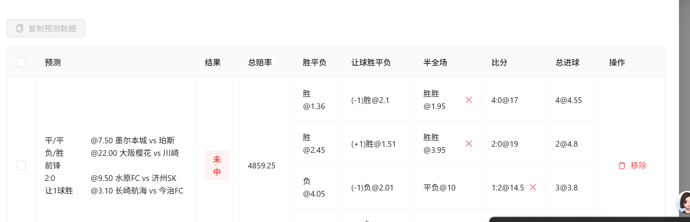
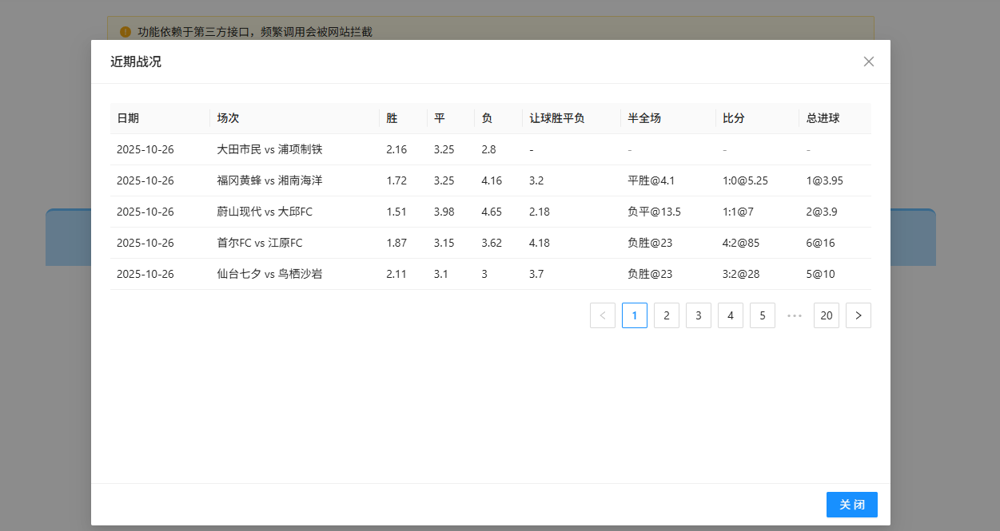

第一步要创建一场预测



新创建的会放在前面，模态框里填写的金额会被累计到外层的总花费上。



点击编辑后进入一个新页面，点击"爬取"按钮，会拉取还未开始的比赛信息



受限于数据过于庞大，当前最多处理 4 只队伍，相互之间的组合有 5 亿多种，点击"选赔率"后弹出模态框，按赔率从小到大展示,赔率则是以串的方式计算

注意，赔率只以此次录入为准，和投注数目没有挂钩，后续进入不会再更新。等同于一块能中多少。

点击“选赔率”按钮则会弹出选取赔率的模态框



支持"随机"一注，点击"预览"切换回去，

点击比赛区域会复制类似信息:

```

7008 让 1 球 负
7010 让 1 球 负
二.四四六

```

也可以点击“添加”按钮。

最后点击“比赛结果”，进行多选后，再点击“复制预测数据”



等到比赛有结果后，在通过“比赛结果”查看是否中奖等详细信息。



可以通过“近期战况”来查看最近的比赛信息，看多了接口调用会被限制，导致数据无法返回,后续调用其余接口也会被限制的，过了一段时间后才会被解除。



温馨提示，多买不见得多中，但少买一定会少赔，10 块即可。
